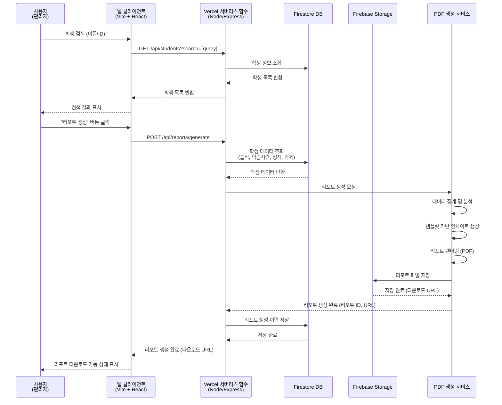
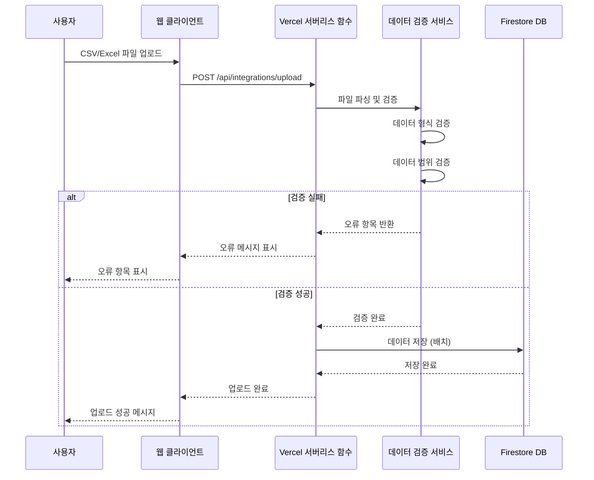
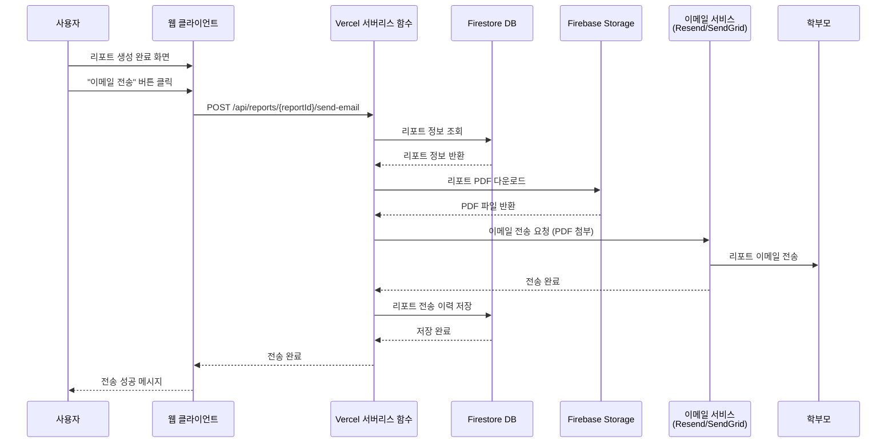

# Software Requirements Specification (SRS) v3.0 - MVP (Final)

Document ID: SRS-003-FINAL  
Revision: 3.0 Final (Node/Express + Firestore + Vercel 스택)  
Date: 2025-01-27  
Standard: ISO/IEC/IEEE 29148:2018

---

## 1. Introduction

### 1.1 Purpose

본 문서는 도심형 통학 관리형 재수 학원을 위한 성과 리포트 자동화 SaaS 시스템의 소프트웨어 요구사항을 정의합니다. 본 SRS는 **MVP(Minimum Viable Product) 범위**에 맞게 조정된 버전으로, **Node.js/Express + Firebase Firestore + Vercel** 기술 스택을 전제로 작성되었습니다.

본 문서는 다음 목적을 위해 사용됩니다:
- MVP 단계 시스템 개발을 위한 요구사항 명세
- 테스트 계획 및 테스트 케이스 작성의 기반
- 시스템 검증 및 확인의 기준
- 변경 관리 및 추적성 확보

### 1.2 Scope

#### In-Scope (MVP 범위)

본 SRS는 다음 기능을 포함하는 MVP(Minimum Viable Product) 범위를 정의합니다:

1. **학생별 종합 성과 리포트 즉시 생성 (F1 - 단순화)**
   - 학생 검색 및 리포트 생성
   - 출석률, 학습 시간, 모의고사 성적, 과제 완료도 통합 리포트
   - **PDF 형식만** 리포트 생성 (30초 이내, Vercel 서버리스 함수 제약 고려)
   - **템플릿 기반 인사이트 생성** (최대 3개, LLM 없이)
   - 리포트 다운로드
   - 리포트 생성 이력 저장

2. **기본 데이터 통합 (F2 - 단순화)**
   - **CSV/Excel 파일 업로드만** 지원 (API 연동 제외)
   - 수동 데이터 입력 인터페이스
   - 데이터 검증 및 통합
   - **단순 통합 대시보드** (테이블 형태, 그래프 제외)

3. **수동 리포트 전송 (F3 - 단순화)**
   - 리포트 생성 후 **수동 이메일 전송 버튼** 제공
   - 이메일 첨부 전송 (PDF)
   - 리포트 전송 이력 저장 (기본)

4. **기본 사용자 관리**
   - 사용자 로그인/로그아웃
   - JWT 토큰 기반 인증 (또는 Firebase Authentication)
   - **단일 관리자 역할** (역할 구분 제외)

5. **기본 시스템 설정**
   - 리포트 템플릿 기본 설정 (커스터마이징 제외)

#### Out-of-Scope (Post-MVP)

다음 기능은 본 MVP 범위에 포함되지 않으며, 향후 릴리즈에서 검토됩니다:

**자동화 기능**
1. 정기 리포트 자동 전송 (스케줄 기반)
2. 위험 신호 자동 감지 및 알림
3. 데이터 불일치 자동 감지
4. 외부 시스템 API 자동 동기화

**고급 기능**
1. PNG 리포트 생성
2. 역할 기반 접근 제어 (다중 역할)
3. 리포트 템플릿 고급 커스터마이징 (학원 로고, 색상)
4. SMS 전송
5. 리포트 열람 여부 추적

**인프라/운영**
1. Kubernetes 배포
2. OpenTelemetry + APM
3. gRPC 통신
4. LLM 기반 인사이트 생성

**기타**
1. 지점별/반별 성과 비교 대시보드
2. 경영 대시보드
3. 학습 활동과 성적 상관관계 분석
4. 모바일 앱 (학부모용)
5. 다국어 지원
6. 실시간 채팅/상담 기능

### 1.2.3 Assumptions

본 시스템 개발 및 운영에 대한 다음과 같은 가정을 전제로 합니다:

#### 기술적 가정
- 외부 시스템(출석 앱, LMS, 모의고사 플랫폼)은 **CSV/Excel 파일 업로드 방식**을 지원합니다.
- Vercel 서버리스 함수 환경에서 운영되며, 인터넷 연결이 필수입니다.
- 이메일 서버(SMTP) 연동이 가능합니다. (Resend, SendGrid 등)
- Firebase Storage를 리포트 PDF 파일 저장소로 사용합니다.

#### 운영 환경 가정
- 학원은 데이터 업로드를 위한 네트워크 환경을 보유합니다.
- 사용자는 최신 브라우저(Chrome, Edge, Safari 최신 2개 버전)를 사용합니다.
- Vercel 서버리스 함수의 실행 시간 제한(10초/60초)을 고려합니다.

#### 데이터 가정
- 학생 데이터는 Firebase Firestore에서 관리되며, 개인정보 보호 규정을 준수합니다.
- 외부 시스템의 데이터 형식은 CSV, Excel 형식을 따릅니다.
- 학원당 최대 500명의 학생 데이터를 처리할 수 있습니다.

#### 사용자 가정
- 사용자는 기본적인 웹 브라우저 사용 능력을 보유합니다.
- 사용자는 엑셀, 구글 시트 등 기본적인 도구 사용 경험이 있습니다.
- 클릭 기반 메뉴 방식 인터페이스를 선호합니다.

### 1.3 Definitions, Acronyms, Abbreviations

| 용어 | 정의 |
|------|------|
| **SaaS** | Software as a Service, 클라우드 기반 소프트웨어 서비스 |
| **LMS** | Learning Management System, 학습 관리 시스템 |
| **API** | Application Programming Interface, 응용 프로그래밍 인터페이스 |
| **MVP** | Minimum Viable Product, 최소 기능 제품 |
| **NPS** | Net Promoter Score, 고객 추천 지수 |
| **Firestore** | Firebase의 NoSQL 문서 데이터베이스 |
| **Vercel** | 서버리스 함수 호스팅 플랫폼 |
| **출석률** | 전체 수업 일수 대비 출석 일수의 비율 (%) |
| **학습 시간** | LMS에서 기록된 일일 학습 시간 (시간 단위) |
| **모의고사 성적** | 모의고사 플랫폼에서 기록된 점수 (점수 단위) |
| **과제 완료도** | 전체 과제 대비 완료한 과제의 비율 (%) |
| **리포트** | 학생의 종합 성과를 시각화한 문서 (PDF 형식) |
| **통합 대시보드** | 여러 시스템의 데이터를 통합하여 표시하는 화면 |

### 1.4 References

| ID | 문서명 | 버전 | 위치 |
|----|--------|------|------|
| REF-01 | Product Requirements Document (PRD) | 1.1 | 30_prd/01_PRD_urban-repeaters.md |
| REF-02 | Vision and Product Strategy (VPS) | 1.1 | 20_vps/01_VPS_urban-repeaters.md |
| REF-03 | SRS MVP 리뷰 및 조정 권장사항 | 1.0 | 40_srs/02_SRS_MVP_Review_and_Recommendations.md |
| REF-04 | ISO/IEC/IEEE 29148:2018 | 2018 | Systems and software engineering — Life cycle processes — Requirements engineering |

## 1.5 Assumptions & Constraints

### 1.5.1 Technical Constraints (기술적 제약)

C-TEC-001: 모든 프론트엔드 애플리케이션은 Vite 기반 React.js(React 18+)를 사용한다.  
C-TEC-002: 모든 백엔드 API 서비스는 Node.js + Express.js를 사용한다.  
C-TEC-003: 데이터베이스는 Firebase Firestore(NoSQL 문서 데이터베이스)를 사용한다.  
C-TEC-004: 인사이트 생성은 Node.js/Express 내 템플릿 기반 규칙 엔진으로 구현한다. (LLM 제외)  
C-TEC-005: 시스템 간 통신은 REST API만 사용한다.  
C-TEC-006: 모든 엔드포인트는 JWT 토큰 기반 인증/인가를 사용한다. (또는 Firebase Authentication)  
C-TEC-007: 서비스 배포는 Vercel 플랫폼을 사용한다. (프론트엔드 및 서버리스 함수)  
C-TEC-008: 리포트 PDF 파일 저장은 Firebase Storage를 사용한다.  
C-TEC-009: 로깅은 기본 로깅을 사용한다. (Vercel 로그 또는 Firebase 로깅)  
C-TEC-010: Vercel 서버리스 함수의 실행 시간 제한을 고려한다. (Hobby 플랜: 10초, Pro 플랜: 60초)

### 1.5.2 External Constraints (외부 제약)

C-EXT-001: 모든 학사·출석·모의고사 원천 데이터는 CSV/Excel 업로드를 통해 제공된다고 가정한다. (API 연동 제외)  
C-EXT-002: 기관별 리포트 템플릿은 기본 템플릿을 사용하며, 커스터마이징은 Post-MVP에서 제공한다.  
C-EXT-003: 외부 시스템의 데이터 형식 및 가용성 저하는 우리 시스템 SLA 대상에서 제외된다.  
C-EXT-004: Vercel 서버리스 함수의 콜드 스타트 지연은 시스템 성능 요구사항에서 제외된다.

### 1.5.3 Operational Assumptions (운영 전제)

C-OPR-001: 초기 배포 환경은 Vercel 플랫폼으로 가정한다.  
C-OPR-002: 학원은 최소 1명 이상의 담당자가 데이터 업로드·검토·승인을 수행한다고 가정한다.  
C-OPR-003: 리포트 전송은 수동으로 수행되며, 자동 스케줄링은 Post-MVP에서 제공한다.

---

## 2. Stakeholders

| Role | Responsibility | Interest |
|------|---------------|----------|
| **원장/관리자** (김원장 페르소나) | 학원 전체 운영 관리, 전략적 의사결정, 재등록률 및 학부모 만족도 향상 | 리포트 제작 시간 절감 (주 5~6시간 → 주 1시간 이하), 데이터 기반 의사결정 지원, 재등록률 70%→85% 달성, 학부모 NPS 50→70 향상 |
| **학사 관리자** (박학사 페르소나) | 리포트 제작, 학부모 상담, 학생 관리, 반별 성적 관리 | 리포트 제작 시간 절감 (주 15시간 → 주 3시간 이하), 학생별 맞춤 관리 케이스 조기 발견, 리포트 오류 빈도 감소 |
| **운영 관리자** (이관리 페르소나) | 데이터 입력, 시스템 연동 관리, 리포트 원천 데이터 관리 | 데이터 입력 오류 최소화, 반복 작업 자동화, 시스템 간 데이터 동기화 |
| **학부모** | 학생 성과 리포트 수신 및 열람 | 정기적이고 일관된 리포트 수신, 자녀의 학습 상태 파악, 학원과의 신뢰 관계 구축 |
| **개발팀** | 시스템 개발 및 유지보수 | 명확한 요구사항 정의, 테스트 가능한 요구사항, 추적 가능한 요구사항 |
| **테스트팀** | 시스템 테스트 및 검증 | 테스트 가능한 요구사항, 명확한 Acceptance Criteria |
| **제품 관리자** | 제품 전략 및 로드맵 관리 | MVP 범위 명확화, 우선순위 관리, 고객 피드백 반영 |

---

## 3. System Context and Interfaces

### 3.1 External Systems

본 시스템은 다음 외부 시스템과 연동됩니다:

| 시스템명 | 연동 방식 | 데이터 유형 | 연동 주기 | 비고 |
|---------|----------|------------|----------|------|
| **출석 관리 앱** | CSV/Excel 파일 업로드 | 학생 ID, 날짜, 출석 여부 | 수동 업로드 | 필수 연동 |
| **LMS (학습 관리 시스템)** | CSV/Excel 파일 업로드 | 학생 ID, 날짜, 학습 시간, 과제 ID, 완료 여부 | 수동 업로드 | 필수 연동 |
| **모의고사 플랫폼** | CSV/Excel 파일 업로드 | 학생 ID, 모의고사 회차, 성적 | 수동 업로드 | 필수 연동 |
| **결제 시스템** | CSV/Excel 파일 업로드 | 학생 ID, 납부 여부 | 수동 업로드 | 선택 연동 |
| **이메일 서버** | SMTP/API (Resend, SendGrid 등) | 리포트 PDF 첨부, 알림 메시지 | 실시간 전송 | 필수 |
| **Firebase Storage** | Firebase SDK | 리포트 PDF 파일 저장 | 실시간 저장 | 필수 |

### 3.2 Client Applications

| 클라이언트 유형 | 기술 스택 | 접근 방식 | 주요 기능 |
|---------------|----------|----------|----------|
| **웹 브라우저** | HTML5, CSS3, JavaScript (Vite + React) | HTTPS | 모든 기능 접근 (리포트 생성, 데이터 통합, 리포트 전송) |
| **모바일 웹** | 반응형 웹 디자인 | HTTPS | 리포트 조회 (제한적 기능) |

### 3.3 API Overview

본 시스템은 다음 API를 제공합니다:

1. **인증 및 권한 관리 API**
   - 사용자 로그인/로그아웃
   - JWT 토큰 기반 인증 (또는 Firebase Authentication)

2. **학생 관리 API**
   - 학생 목록 조회
   - 학생 검색
   - 학생 상세 정보 조회

3. **리포트 생성 API**
   - 리포트 생성 요청
   - 리포트 다운로드
   - 리포트 생성 이력 조회

4. **데이터 통합 API**
   - 파일 업로드 데이터 수집
   - 수동 데이터 입력
   - 통합 대시보드 데이터 조회

5. **리포트 전송 API**
   - 수동 리포트 이메일 전송
   - 리포트 전송 이력 조회

상세 API 엔드포인트 목록은 부록 6.1을 참조하십시오.

### 3.4 Interaction Sequences

#### 3.4.1 핵심 시퀀스: 학생별 리포트 생성 (F1)



#### 3.4.2 핵심 시퀀스: 데이터 파일 업로드 및 통합 (F2)



#### 3.4.3 핵심 시퀀스: 수동 리포트 이메일 전송 (F3)



---

## 4. Specific Requirements

### 4.1 Functional Requirements

| ID | Title | Description | Source | Priority | Acceptance Criteria | Verification | Status | 기술 스택 고려사항 |
|----|-------|-------------|--------|----------|---------------------|--------------|--------|------------------|
| **REQ-FUNC-001** | 학생 검색 | 시스템은 학생 이름 또는 학생 ID로 학생을 검색할 수 있어야 한다. | F1 | High | Given: 학생 데이터가 Firestore에 존재할 때<br/>When: 사용자가 학생 이름 또는 ID를 입력하여 검색하면<br/>Then: 해당하는 학생 목록이 표시되어야 한다. 검색 결과는 최대 50명까지 표시되며, 페이지네이션을 지원해야 한다. | Test: 검색 기능 테스트, 부분 일치 검색 테스트 | Proposed | Firestore 쿼리 사용 |
| **REQ-FUNC-002** | 리포트 생성 요청 | 시스템은 사용자가 선택한 학생에 대해 리포트 생성을 요청받을 수 있어야 한다. | F1 | High | Given: 학생이 선택된 상태일 때<br/>When: 사용자가 "리포트 생성" 버튼을 클릭하면<br/>Then: 리포트 생성 프로세스가 시작되어야 하며, 진행 상태가 표시되어야 한다. | Test: 리포트 생성 요청 API 테스트 | Proposed | Vercel 서버리스 함수 제한 고려 |
| **REQ-FUNC-003** | 출석 데이터 조회 | 시스템은 리포트 생성 시 학생의 출석 데이터를 조회할 수 있어야 한다. | F1 | High | Given: 리포트 생성 요청이 있을 때<br/>When: 시스템이 출석 데이터를 조회하면<br/>Then: Firestore `attendance` 컬렉션에서 학생 ID로 출석 데이터를 조회하여 전체 기간 및 최근 4주 출석률을 계산할 수 있어야 한다. | Test: 출석 데이터 조회 테스트, 출석률 계산 로직 테스트 | Proposed | Firestore 쿼리 및 집계 |
| **REQ-FUNC-004** | 학습 시간 데이터 조회 | 시스템은 리포트 생성 시 학생의 학습 시간 데이터를 조회할 수 있어야 한다. | F1 | High | Given: 리포트 생성 요청이 있을 때<br/>When: 시스템이 학습 시간 데이터를 조회하면<br/>Then: Firestore `study_time` 컬렉션에서 학생 ID로 학습 시간 데이터를 조회하여 일평균, 주평균, 목표 대비 달성률을 계산할 수 있어야 한다. | Test: 학습 시간 데이터 조회 테스트, 집계 계산 테스트 | Proposed | Firestore 쿼리 및 집계 |
| **REQ-FUNC-005** | 모의고사 성적 데이터 조회 | 시스템은 리포트 생성 시 학생의 모의고사 성적 데이터를 조회할 수 있어야 한다. | F1 | High | Given: 리포트 생성 요청이 있을 때<br/>When: 시스템이 모의고사 성적 데이터를 조회하면<br/>Then: Firestore `mock_exam` 컬렉션에서 학생 ID로 최근 5회 모의고사 성적을 조회하여 추이 분석 및 등급 변화를 계산할 수 있어야 한다. | Test: 모의고사 성적 조회 테스트, 추이 분석 테스트 | Proposed | Firestore 쿼리 및 정렬 |
| **REQ-FUNC-006** | 과제 완료도 데이터 조회 | 시스템은 리포트 생성 시 학생의 과제 완료도 데이터를 조회할 수 있어야 한다. | F1 | High | Given: 리포트 생성 요청이 있을 때<br/>When: 시스템이 과제 완료도 데이터를 조회하면<br/>Then: Firestore `assignments` 컬렉션에서 학생 ID로 과제 완료 데이터를 조회하여 완료율 및 미완료 과제 목록(최대 10개)을 계산할 수 있어야 한다. | Test: 과제 완료도 조회 테스트 | Proposed | Firestore 쿼리 및 필터링 |
| **REQ-FUNC-007** | 반 평균 데이터 계산 | 시스템은 리포트 생성 시 학생이 속한 반의 평균 데이터를 계산할 수 있어야 한다. | F1 | High | Given: 리포트 생성 요청이 있을 때<br/>When: 시스템이 반 평균 데이터를 계산하면<br/>Then: 더미 데이터 또는 하드코딩된 평균값을 사용하여 학생과의 차이를 산출할 수 있어야 한다. | Test: 반 평균 계산 테스트 | Proposed | 단순화: 하드코딩된 값 사용 |
| **REQ-FUNC-008** | 인사이트 자동 생성 | 시스템은 리포트 생성 시 학습 시간 감소, 출석률 하락, 성적 향상 등의 인사이트를 템플릿 기반 규칙 엔진으로 생성할 수 있어야 한다. | F1 | High | Given: 리포트 생성 요청이 있을 때<br/>When: 시스템이 인사이트를 생성하면<br/>Then: 최대 3개의 인사이트 텍스트가 생성되어야 한다. 인사이트는 Node.js 템플릿 기반 규칙 엔진을 사용하여 "최근 N주간 학습 시간이 목표 대비 X% 감소했습니다" 형식으로 생성되어야 한다. (LLM 사용 없음) | Test: 인사이트 생성 로직 테스트 | Proposed | Node.js 템플릿 엔진 사용 |
| **REQ-FUNC-009** | 리포트 PDF 생성 | 시스템은 리포트를 PDF 형식으로 생성할 수 있어야 한다. | F1 | High | Given: 리포트 데이터가 준비된 상태일 때<br/>When: 시스템이 리포트를 PDF로 생성하면<br/>Then: A4 용지 기준의 PDF 파일이 생성되어야 하며, 기본 정보, 그래프 및 차트가 포함되어야 한다. Vercel 서버리스 함수 실행 시간 제한 내에 완료되어야 한다. | Test: PDF 생성 테스트, 리포트 내용 검증 테스트 | Proposed | **⚠️ 복잡도 높음**: PDF 생성 라이브러리 (puppeteer, pdfkit 등) 사용, 실행 시간 최적화 필요 |
| **REQ-FUNC-011** | 리포트 생성 시간 제한 | 시스템은 리포트 생성이 30초를 초과하면 실패 처리해야 한다. | F1 | High | Given: 리포트 생성 요청이 있을 때<br/>When: 리포트 생성이 30초를 초과하면<br/>Then: 리포트 생성이 실패 처리되고 사용자에게 에러 메시지가 표시되어야 한다. 단, Vercel Hobby 플랜(10초 제한) 사용 시에는 비동기 처리 또는 큐 시스템을 고려해야 한다. | Test: 리포트 생성 시간 제한 테스트 | Proposed | **⚠️ 제약사항**: Vercel 함수 실행 시간 제한 고려 (비동기 처리 필요) |
| **REQ-FUNC-012** | 리포트 다운로드 | 시스템은 생성된 리포트를 다운로드할 수 있도록 제공해야 한다. | F1 | High | Given: 리포트가 Firebase Storage에 저장된 상태일 때<br/>When: 사용자가 리포트 다운로드를 요청하면<br/>Then: PDF 형식의 리포트 파일이 다운로드되어야 한다. | Test: 리포트 다운로드 테스트 | Proposed | Firebase Storage 다운로드 URL 사용 |
| **REQ-FUNC-013** | 리포트 생성 이력 저장 | 시스템은 리포트 생성 이벤트를 로그로 저장해야 한다. | F1 | High | Given: 리포트 생성이 완료된 상태일 때<br/>When: 시스템이 리포트 생성 이력을 저장하면<br/>Then: 리포트 ID, 학생 ID, 생성 시간, 리포트 유형, 다운로드 여부가 Firestore에 저장되어야 한다. | Test: 리포트 생성 이력 저장 테스트 | Proposed | Firestore 저장 |
| **REQ-FUNC-015** | 파일 업로드 데이터 수집 | 시스템은 사용자가 CSV/Excel 파일을 업로드하여 데이터를 수집할 수 있어야 한다. | F2 | High | Given: 사용자가 파일 업로드 페이지에 접근할 때<br/>When: 사용자가 CSV 또는 Excel 파일(최대 50MB)을 업로드하면<br/>Then: 파일이 파싱되어 데이터가 추출되고, 데이터 검증이 수행되어야 한다. 검증 실패 시 오류 항목이 표시되어야 한다. | Test: 파일 업로드 테스트, 파일 파싱 테스트, 데이터 검증 테스트 | Proposed | **⚠️ 복잡도 중간**: 파일 파싱 라이브러리 (papaparse, xlsx 등) 사용, Vercel 함수 제한 고려 |
| **REQ-FUNC-016** | 수동 데이터 입력 | 시스템은 사용자가 수동으로 데이터를 입력할 수 있는 인터페이스를 제공해야 한다. | F2 | High | Given: 파일 업로드가 불가능한 경우<br/>When: 사용자가 수동 입력 인터페이스를 통해 데이터를 입력하면<br/>Then: 데이터가 즉시 Firestore에 저장되고 검증되어야 한다. | Test: 수동 데이터 입력 테스트 | Proposed | Firestore 실시간 저장 |
| **REQ-FUNC-018** | 데이터 검증 | 시스템은 수집된 데이터의 형식 및 범위를 검증해야 한다. | F2 | High | Given: 데이터가 수집된 상태일 때<br/>When: 시스템이 데이터 검증을 수행하면<br/>Then: 필수 필드 존재 여부, 데이터 타입, 날짜 범위, 값 범위를 확인해야 한다. 검증 실패 시 오류 메시지가 표시되어야 한다. | Test: 데이터 검증 테스트 | Proposed | Node.js 검증 라이브러리 (Joi, Zod 등) 사용 |
| **REQ-FUNC-019** | 데이터 통합 | 시스템은 여러 외부 시스템에서 수집된 데이터를 학생 ID 기준으로 통합해야 한다. | F2 | High | Given: 여러 시스템에서 데이터가 수집된 상태일 때<br/>When: 시스템이 데이터 통합을 수행하면<br/>Then: 학생 ID를 기준으로 Firestore `attendance`, `study_time`, `mock_exam`, `payment` 컬렉션에 데이터가 저장되어야 한다. | Test: 데이터 통합 테스트 | Proposed | Firestore 배치 쓰기 사용 |
| **REQ-FUNC-021** | 통합 대시보드 표시 | 시스템은 통합된 데이터를 대시보드 형태로 표시해야 한다. | F2 | High | Given: 데이터가 Firestore에 통합된 상태일 때<br/>When: 사용자가 통합 대시보드에 접근하면<br/>Then: 출석률, 학습 시간, 모의고사 성적, 결제 현황을 테이블 형태로 표시해야 한다. (그래프/차트 제외) | Test: 통합 대시보드 표시 테스트 | Proposed | Firestore 쿼리 및 집계 |
| **REQ-FUNC-028** | 리포트 전송 이력 저장 | 시스템은 리포트 전송 이력을 저장해야 한다. | F3 | High | Given: 리포트가 전송된 상태일 때<br/>When: 시스템이 리포트 전송 이력을 저장하면<br/>Then: 리포트 ID, 학생 ID, 학부모 이메일, 전송 시간, 전송 성공/실패 여부가 Firestore `report_delivery` 컬렉션에 저장되어야 한다. | Test: 리포트 전송 이력 저장 테스트 | Proposed | Firestore 저장 |
| **REQ-FUNC-041** | 수동 리포트 이메일 전송 | 시스템은 리포트 생성 후 수동으로 이메일 전송을 수행할 수 있어야 한다. | F3 | High | Given: 리포트가 Firebase Storage에 저장된 상태일 때<br/>When: 사용자가 "이메일 전송" 버튼을 클릭하면<br/>Then: 리포트 PDF가 첨부된 이메일이 학부모 이메일 주소로 전송되어야 한다. (Resend, SendGrid 등 사용) | Test: 리포트 이메일 전송 테스트 | Proposed | 이메일 서비스 API 연동 |
| **REQ-FUNC-036** | 사용자 인증 | 시스템은 사용자 로그인을 통해 인증을 수행해야 한다. | - | High | Given: 사용자가 로그인 페이지에 접근할 때<br/>When: 사용자가 이메일과 비밀번호를 입력하여 로그인하면<br/>Then: 인증이 성공하면 JWT 토큰이 발급되어야 하며, 인증이 실패하면 에러 메시지가 표시되어야 한다. (또는 Firebase Authentication 사용) | Test: 사용자 인증 테스트 | Proposed | JWT 또는 Firebase Authentication |
| **REQ-FUNC-037** | 기본 접근 제어 | 시스템은 로그인된 사용자만 기능에 접근할 수 있어야 한다. | - | High | Given: 사용자가 로그인된 상태일 때<br/>When: 사용자가 기능에 접근하려고 하면<br/>Then: 모든 로그인된 사용자는 동일한 권한으로 모든 기능에 접근할 수 있어야 한다. (역할 구분 제외) | Test: 기본 접근 제어 테스트 | Proposed | JWT 토큰 검증 또는 Firebase Auth |
| **REQ-FUNC-038** | 리포트 템플릿 기본 설정 | 시스템은 기본 리포트 템플릿을 사용한다. | - | Medium | Given: 리포트가 생성될 때<br/>When: 시스템이 리포트 템플릿을 적용하면<br/>Then: 기본 템플릿이 사용되어야 한다. (커스터마이징 제외) | Test: 리포트 템플릿 기본 설정 테스트 | Proposed | HTML/CSS 템플릿 사용 |

### 4.2 Non-Functional Requirements

| ID | Category | Description (Measurable) | Acceptance Criteria | Verification | 기술 스택 고려사항 |
|----|----------|-------------------------|---------------------|--------------|------------------|
| **REQ-NF-001** | Performance | 리포트 생성 성능: 리포트 생성 시작 후 30초 이내 완료 | 리포트 생성 버튼 클릭 후 30초 이내에 리포트가 생성되어야 한다. 단, Vercel Hobby 플랜(10초 제한) 사용 시에는 비동기 처리 또는 큐 시스템을 고려해야 한다. | 성능 테스트: 리포트 생성 시간 측정, 부하 테스트 | **⚠️ 제약사항**: Vercel 함수 실행 시간 제한 고려 |
| **REQ-NF-004** | Performance | 동시 리포트 생성 처리: 최대 10건 동시 처리 | 리포트 생성 요청이 동시에 10건 이상 발생하면 초과 요청은 대기열에 추가되어야 한다. | 부하 테스트: 동시 리포트 생성 처리 테스트 | Vercel 동시 실행 제한 고려 |
| **REQ-NF-005** | Performance | API 응답 시간: 평균 500ms 이내 | API 엔드포인트의 평균 응답 시간이 500ms 이내여야 한다. (리포트 생성 제외) | 성능 테스트: API 응답 시간 측정 | Firestore 쿼리 최적화 필요 |
| **REQ-NF-006** | Reliability | 시스템 가동률: 95% 이상 | 시스템은 연간 가동률 95% 이상을 유지해야 한다. (계획된 유지보수 시간 제외) | 모니터링: 시스템 가동률 측정 | Vercel 가동률 의존 |
| **REQ-NF-007** | Reliability | 데이터 통합 정확도: 99% 이상 | 실제 데이터 대비 통합 데이터 일치율이 99% 이상이어야 한다. | 데이터 정확도 테스트: 샘플 데이터 검증 | Firestore 트랜잭션 사용 고려 |
| **REQ-NF-008** | Reliability | 리포트 생성 성공률: 90% 이상 | 리포트 생성 요청 중 90% 이상이 성공적으로 완료되어야 한다. | 모니터링: 리포트 생성 성공률 측정 | Vercel 함수 실패 처리 |
| **REQ-NF-011** | Scalability | 동시 사용자 지원: 최대 20명 | 시스템은 최대 20명의 동시 사용자를 지원해야 한다. | 부하 테스트: 동시 사용자 테스트 | Vercel 동시 실행 제한 고려 |
| **REQ-NF-012** | Scalability | 학생 데이터 지원: 학원당 최대 500명 | 시스템은 학원당 최대 500명의 학생 데이터를 지원해야 한다. | 확장성 테스트 | Firestore 쿼리 최적화 필요 |
| **REQ-NF-013** | Security | 데이터 암호화: 비밀번호 암호화 저장 | 사용자 비밀번호는 암호화되어 저장되어야 한다. | 보안 테스트: 암호화 검증 | bcrypt 또는 Firebase Auth 사용 |
| **REQ-NF-014** | Security | 인증 토큰 유효기간: 24시간 | JWT 토큰의 유효기간은 24시간이며, 만료 시 재로그인이 필요하다. | 보안 테스트: 토큰 만료 테스트 | JWT 또는 Firebase Auth |
| **REQ-NF-015** | Security | HTTPS 통신: 모든 통신은 HTTPS 사용 | 웹 클라이언트와 API 서버 간 모든 통신은 HTTPS를 사용해야 한다. | 보안 테스트: HTTPS 통신 검증 | Vercel 기본 제공 |
| **REQ-NF-016** | Security | 개인정보 보호: 학생 및 학부모 개인정보 암호화 저장 | 학생 및 학부모의 개인정보(이름, 이메일, 전화번호)는 암호화되어 저장되어야 한다. | 보안 테스트: 개인정보 암호화 검증 | Firestore 보안 규칙 및 암호화 |
| **REQ-NF-017** | Usability | 사용자 가이드: 온라인 도움말 제공 | 시스템은 주요 기능에 대한 온라인 도움말을 제공해야 한다. | 사용성 테스트: 도움말 접근성 테스트 | - |
| **REQ-NF-018** | Usability | 에러 메시지: 명확하고 이해하기 쉬운 에러 메시지 | 시스템은 에러 발생 시 명확하고 이해하기 쉬운 에러 메시지를 표시해야 한다. | 사용성 테스트: 에러 메시지 검증 | - |
| **REQ-NF-019** | Usability | 반응형 웹 디자인: 모바일 기기 지원 | 웹 인터페이스는 모바일 기기에서도 사용 가능하도록 반응형 디자인을 적용해야 한다. | 사용성 테스트: 모바일 호환성 테스트 | - |
| **REQ-NF-020** | Maintainability | 로깅: 모든 주요 이벤트 로깅 | 시스템은 리포트 생성, 데이터 업로드 등 모든 주요 이벤트를 로깅해야 한다. | 로깅 검증 테스트 | Vercel 로그 또는 Firebase 로깅 |
| **REQ-NF-022** | Compatibility | 브라우저 지원: Chrome, Edge, Safari 최신 2개 버전 | 웹 인터페이스는 Chrome, Edge, Safari의 최신 2개 버전을 지원해야 한다. | 호환성 테스트: 브라우저 테스트 | - |
| **REQ-NF-023** | Compatibility | 파일 형식 지원: CSV, Excel (.xlsx, .xls) | 파일 업로드 기능은 CSV, Excel (.xlsx, .xls) 형식을 지원해야 한다. | 호환성 테스트: 파일 형식 테스트 | 파일 파싱 라이브러리 사용 |
| **REQ-NF-024** | Constraints | 파일 업로드 크기 제한: 최대 50MB | 파일 업로드 시 최대 50MB까지 지원해야 한다. 단, Vercel 함수 제한을 고려하여 클라이언트 측 파싱 또는 청크 업로드를 고려해야 한다. | 제약사항 검증 테스트 | **⚠️ 제약사항**: Vercel 함수 페이로드 제한 고려 |
| **REQ-NF-025** | Constraints | 리포트 생성 대상 제한: 한 번에 최대 100명 | 리포트 생성 요청 시 한 번에 최대 100명까지 처리할 수 있어야 한다. | 제약사항 검증 테스트 | 비동기 처리 또는 큐 시스템 필요 |
| **REQ-NF-028** | Constraints | 실행 시간 제한: 리포트 생성 30초 | 리포트 생성은 30초를 초과하면 실패 처리해야 한다. 단, Vercel Hobby 플랜(10초 제한) 사용 시에는 비동기 처리 또는 큐 시스템을 고려해야 한다. | 제약사항 검증 테스트 | **⚠️ 제약사항**: Vercel 함수 실행 시간 제한 |
| **REQ-NF-029** | Business Impact | 리포트 제작 시간 절감: 93% 이상 | 리포트 제작 시간이 주 15시간에서 주 1시간 이하로 단축되어야 한다. (93% 이상 절감) | 비즈니스 KPI 측정: 리포트 제작 시간 추적 | - |
| **REQ-NF-030** | Business Impact | 데이터 통합 시간 절감: 90% 이상 | 데이터 통합 시간이 주 5시간에서 주 30분 이하로 단축되어야 한다. (90% 이상 절감) | 비즈니스 KPI 측정: 데이터 통합 시간 추적 | - |
| **REQ-NF-031** | Business Impact | 학부모 만족도(NPS) 향상: 50 → 65 이상 | 학부모 만족도(NPS)가 50에서 65 이상으로 향상되어야 한다. | 비즈니스 KPI 측정: NPS 설문조사 | - |
| **REQ-NF-032** | Business Impact | 재등록률 향상: 70% → 75% 이상 | 재등록률이 70%에서 75% 이상으로 향상되어야 한다. | 비즈니스 KPI 측정: 재등록률 추적 | - |
| **REQ-NF-033** | Business Impact | 리포트 생성 속도 달성률: 95% 이상 | 학생별 리포트 생성 속도 30초 이내 달성률이 95% 이상이어야 한다. 단, Vercel 함수 제한을 고려하여 비동기 처리 시 완료율 기준으로 측정한다. | 성능 모니터링: 리포트 생성 시간 분포 분석 | **⚠️ 제약사항**: 비동기 처리 고려 |
| **REQ-NF-034** | Business Impact | 리포트 정확도 향상: 85% → 99% 이상 | 리포트 정확도가 85%에서 99% 이상으로 향상되어야 한다. | 데이터 정확도 테스트: 리포트 내용 검증 | - |

---

## 5. Traceability Matrix

| Story/Feature | Requirement ID | Test Case ID | Status |
|---------------|----------------|--------------|--------|
| **F1: 학생별 종합 성과 리포트 즉시 생성** | REQ-FUNC-001 ~ REQ-FUNC-013 | TC-F1-001 ~ TC-F1-013 | Proposed |
| **F2: 기본 데이터 통합** | REQ-FUNC-015, REQ-FUNC-016, REQ-FUNC-018, REQ-FUNC-019, REQ-FUNC-021 | TC-F2-001 ~ TC-F2-005 | Proposed |
| **F3: 수동 리포트 전송** | REQ-FUNC-028, REQ-FUNC-041 | TC-F3-001 ~ TC-F3-002 | Proposed |
| **사용자 인증 및 권한 관리** | REQ-FUNC-036 ~ REQ-FUNC-037 | TC-AUTH-001 ~ TC-AUTH-002 | Proposed |
| **학부모 상담 시 30초 이내 리포트 생성** | REQ-NF-001 | TC-PERF-001 | Proposed |
| **리포트 생성 성공률 90% 이상** | REQ-NF-008 | TC-PERF-002 | Proposed |
| **데이터 통합 정확도 99% 이상** | REQ-NF-007 | TC-RELI-001 | Proposed |
| **시스템 가동률 95% 이상** | REQ-NF-006 | TC-RELI-002 | Proposed |
| **리포트 제작 시간 절감 (93% 이상)** | REQ-NF-029 | TC-BIZ-001 | Proposed |
| **데이터 통합 시간 절감 (90% 이상)** | REQ-NF-030 | TC-BIZ-002 | Proposed |
| **학부모 만족도(NPS) 향상 (50→65)** | REQ-NF-031 | TC-BIZ-003 | Proposed |
| **재등록률 향상 (70%→75%)** | REQ-NF-032 | TC-BIZ-004 | Proposed |
| **리포트 생성 속도 달성률 (95% 이상)** | REQ-NF-033 | TC-PERF-003 | Proposed |
| **리포트 정확도 향상 (85%→99%)** | REQ-NF-034 | TC-RELI-003 | Proposed |

---

## 6. Appendix

### 6.1 API Endpoint List

| Method | Endpoint | Description | Request Body | Response | Authentication |
|--------|----------|-------------|--------------|----------|---------------|
| **POST** | `/api/auth/login` | 사용자 로그인 | `{ "email": string, "password": string }` | `{ "token": string, "user": object }` | None |
| **POST** | `/api/auth/logout` | 사용자 로그아웃 | - | `{ "message": string }` | Required |
| **GET** | `/api/students` | 학생 목록 조회 | Query: `?search={query}&page={page}&limit={limit}` | `{ "students": array, "total": number, "page": number }` | Required |
| **GET** | `/api/students/{studentId}` | 학생 상세 정보 조회 | - | `{ "student": object }` | Required |
| **POST** | `/api/reports/generate` | 리포트 생성 요청 | `{ "studentId": string, "format": "pdf" }` | `{ "reportId": string, "downloadUrl": string, "status": "processing" \| "completed" }` | Required |
| **GET** | `/api/reports/{reportId}/download` | 리포트 다운로드 | - | File (PDF) | Required |
| **GET** | `/api/reports/history` | 리포트 생성 이력 조회 | Query: `?studentId={id}&page={page}&limit={limit}` | `{ "reports": array, "total": number }` | Required |
| **POST** | `/api/reports/{reportId}/send-email` | 수동 리포트 이메일 전송 | `{ "parentEmail": string }` | `{ "deliveryId": string, "status": string }` | Required |
| **GET** | `/api/reports/delivery/history` | 리포트 전송 이력 조회 | Query: `?studentId={id}&page={page}&limit={limit}` | `{ "deliveries": array, "total": number }` | Required |
| **POST** | `/api/integrations/upload` | 파일 업로드 데이터 수집 | FormData: `{ "file": File, "systemType": string }` | `{ "uploadId": string, "status": string, "errors": array }` | Required |
| **POST** | `/api/integrations/manual` | 수동 데이터 입력 | `{ "systemType": string, "data": object }` | `{ "status": string }` | Required |
| **GET** | `/api/integrations/dashboard` | 통합 대시보드 데이터 조회 | Query: `?period={daily\|weekly\|monthly}` | `{ "attendance": object, "studyTime": object, "mockExam": object, "payment": object }` | Required |

### 6.2 Entity & Data Model (Firestore 구조)

#### 6.2.1 주요 컬렉션

**students (학생)**
```
{
  studentId: string (문서 ID),
  name: string (암호화),
  classId: string,
  branchId: string,
  parentEmail: string (암호화),
  parentPhone: string (암호화),
  createdAt: Timestamp,
  updatedAt: Timestamp
}
```

**attendance (출석)**
```
{
  attendanceId: string (문서 ID),
  studentId: string,
  date: Timestamp,
  isPresent: boolean,
  sourceSystem: string,
  createdAt: Timestamp
}
```

**study_time (학습 시간)**
```
{
  studyTimeId: string (문서 ID),
  studentId: string,
  date: Timestamp,
  hours: number,
  sourceSystem: string,
  createdAt: Timestamp
}
```

**mock_exam (모의고사 성적)**
```
{
  mockExamId: string (문서 ID),
  studentId: string,
  examRound: number,
  score: number,
  grade: string,
  examDate: Timestamp,
  sourceSystem: string,
  createdAt: Timestamp
}
```

**assignments (과제)**
```
{
  assignmentId: string (문서 ID),
  studentId: string,
  assignmentName: string,
  isCompleted: boolean,
  dueDate: Timestamp,
  sourceSystem: string,
  createdAt: Timestamp
}
```

**reports (리포트)**
```
{
  reportId: string (문서 ID),
  studentId: string,
  reportType: string,
  format: string ("pdf"),
  filePath: string (Firebase Storage 경로),
  downloadUrl: string,
  generatedAt: Timestamp,
  downloadedAt: Timestamp | null,
  createdBy: string,
  status: string ("processing" | "completed" | "failed")
}
```

**report_delivery (리포트 전송 이력)**
```
{
  deliveryId: string (문서 ID),
  reportId: string,
  studentId: string,
  parentEmail: string,
  sentAt: Timestamp,
  deliveryStatus: string ("success" | "failed")
}
```

**users (사용자)**
```
{
  userId: string (문서 ID),
  email: string,
  password: string (암호화, 또는 Firebase Auth 사용 시 제외),
  name: string,
  createdAt: Timestamp,
  updatedAt: Timestamp
}
```

#### 6.2.2 Firestore 인덱스 요구사항

다음 필드 조합에 대한 복합 인덱스가 필요합니다:
- `attendance`: `studentId` + `date` (내림차순)
- `study_time`: `studentId` + `date` (내림차순)
- `mock_exam`: `studentId` + `examDate` (내림차순)
- `assignments`: `studentId` + `dueDate` (내림차순)
- `reports`: `studentId` + `generatedAt` (내림차순)

### 6.3 기술 스택별 구현 고려사항

#### 6.3.1 복잡도 높은 요구사항 및 대안

**1. 리포트 PDF 생성 (REQ-FUNC-009)**
- **문제점**: Vercel 서버리스 함수 실행 시간 제한 (Hobby: 10초, Pro: 60초)
- **대안**:
  - 비동기 처리: 리포트 생성 요청 시 즉시 응답하고, 백그라운드에서 PDF 생성 후 완료 알림
  - 큐 시스템: Vercel Queue 또는 외부 큐 서비스 사용
  - 클라이언트 측 생성: PDF 생성 로직을 클라이언트로 이동 (브라우저에서 생성)
  - 단순화: PDF 대신 HTML 리포트 제공 (인쇄 기능 사용)

**2. 리포트 생성 시간 제한 (REQ-FUNC-011, REQ-NF-001, REQ-NF-028)**
- **문제점**: Vercel 함수 실행 시간 제한
- **대안**:
  - 비동기 처리: 리포트 생성 요청 시 즉시 응답하고, 상태 조회 API 제공
  - Vercel Pro 플랜 사용: 60초 제한으로 확장
  - 외부 서비스 사용: PDF 생성 전용 서비스 (예: PDFShift, Browserless 등)

**3. 파일 업로드 크기 제한 (REQ-NF-024)**
- **문제점**: Vercel 함수 페이로드 제한 (4.5MB)
- **대안**:
  - 클라이언트 측 파싱: 브라우저에서 파일 파싱 후 데이터만 전송
  - 청크 업로드: 파일을 작은 청크로 나누어 업로드
  - Firebase Storage 직접 업로드: 클라이언트에서 Firebase Storage에 직접 업로드 후 함수에서 처리

**4. 동시 리포트 생성 처리 (REQ-NF-004, REQ-NF-025)**
- **문제점**: Vercel 동시 실행 제한
- **대안**:
  - 큐 시스템: Vercel Queue 또는 외부 큐 서비스 사용
  - 순차 처리: 동시 요청을 큐에 추가하여 순차 처리
  - 단순화: 동시 생성 제한을 5건으로 축소

#### 6.3.2 권장 구현 방식

**리포트 생성 프로세스 (권장)**
1. 사용자가 리포트 생성 요청
2. 서버리스 함수가 즉시 응답 (상태: "processing")
3. 백그라운드 작업 큐에 리포트 생성 작업 추가
4. 별도 워커 함수가 큐에서 작업을 가져와 PDF 생성
5. Firebase Storage에 저장 후 Firestore 상태 업데이트
6. 클라이언트가 폴링 또는 WebSocket으로 상태 확인

**파일 업로드 프로세스 (권장)**
1. 클라이언트에서 파일을 파싱 (papaparse, xlsx 라이브러리 사용)
2. 파싱된 데이터만 서버리스 함수로 전송
3. 서버리스 함수에서 데이터 검증 및 Firestore 저장

---

**작성자**: 시니어 프로덕트 매니저 / 시니어 개발자  
**검토일**: 2025-01-27  
**버전**: 3.0 Final (Node/Express + Firestore + Vercel)

